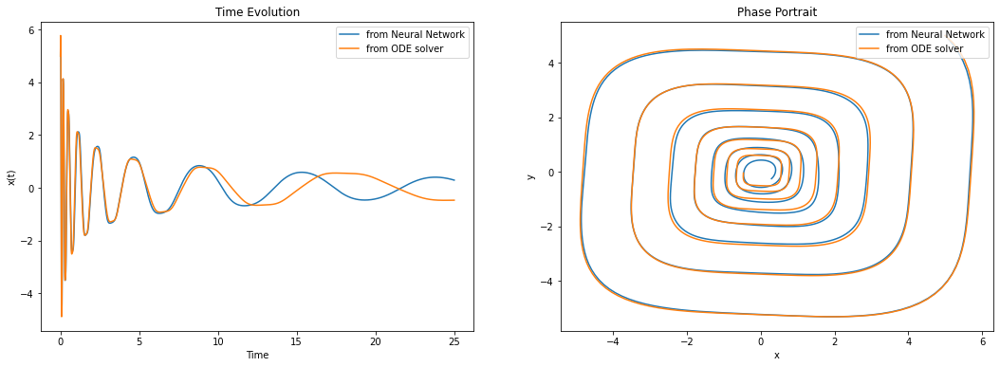
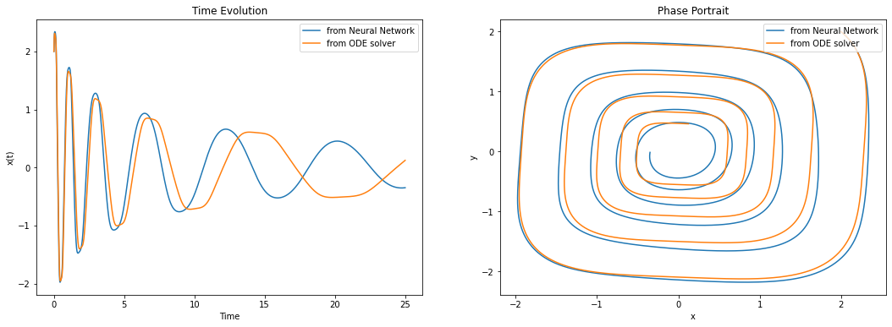
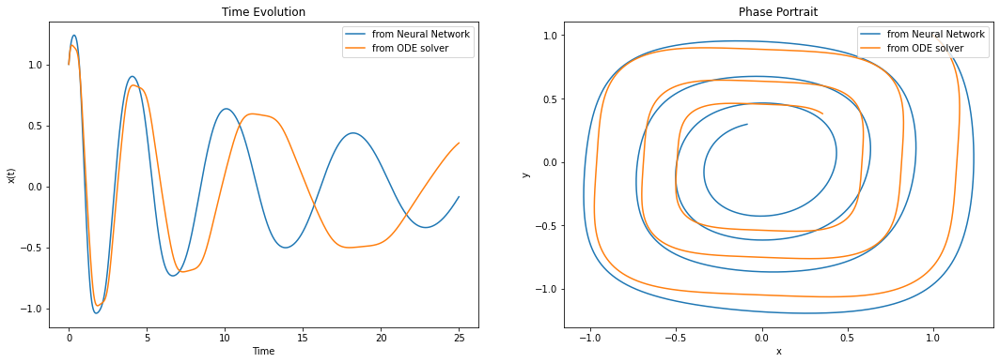

# neural-network-differential-equations
Experiments with using neural networks to solve differential equations. In this particular example, the non-linear ODE of a damped simple harmonic oscillator is considered. The ideas are based on the work of Raissi et al. from https://arxiv.org/abs/1801.01236. Using an MLP with just 1 fully-connected layer with 32 neurons is usually sufficient to replicate the dynamics of the system considered here, as shown.

To check for general model behaviour, 2 additional cases are considered, each with a different initial condition:

