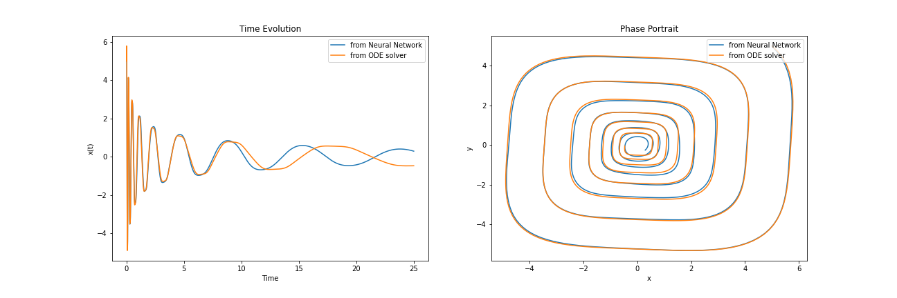

# neural-network-differential-equations
Experiments with using neural networks to solve differential equations. In this particular example, the non-linear ODE of a damped simple harmonic oscillator is considered. The ideas are based on the work of Raissi et al. from https://arxiv.org/abs/1801.01236. Using an MLP with just 1 fully-connected layer with 32 neurons is sufficient to replicate the dynamics of the system considered here.

An example of the results is shown here (with a different initial condition as compared to the one used in the training data):

